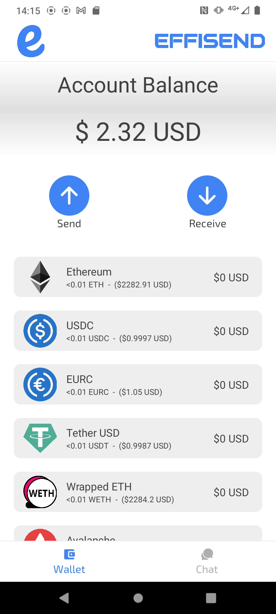
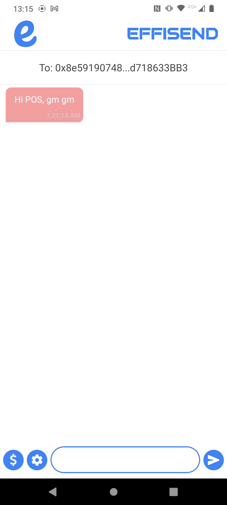

# EffiSend
 
EffiSend: Slogan

## Fast Links:

WALLET CODE: [CODE](./ExpoApp/)

PLAYSTORE LINK: [LINK](https://play.google.com/store/apps/details?id=com.altaga.effisend.privy)

VIDEODEMO: [VIDEO](PENDING...)

# System Diagram:

## Wallet Services:

- [Expo SDK](https://docs.privy.io/guide/expo/): Para el desarrollo de la aplicacion nativa utilizamos el Expo SDK proporcionado por Privy. Gracias a nuestra experiencia previa en el desarrollo de aplicaciones nativas para Android mediante React Native, pudimos crear el prototipo de manera más ágil. 

- [Authentication](https://docs.privy.io/guide/authentication): A través del SDK de Privy, es posible realizar el onboarding de los usuarios en pocos clics y utilizando solo su correo electrónico. Además, esta funcionalidad permite recuperar el acceso a los assets y mensajes que esta contiene en caso de que el dispositivo se pierda o sufra daños.

- [Embedded wallets](https://docs.privy.io/guide/embedded-wallets): El SDK de Privy nos facilitó enormemente la creación de una wallet de forma rápida, eliminando la necesidad de configurar la encriptación, salvado de private key y la firma de transacciones. 

- [Bridge API](https://docs.privy.io/guide/react/recipes/misc/card-based-funding#_1-enable-debit-card-funding-in-the-dashboard): Para realizar el Top-up a la wallet utilizamos el On-Ramp de Privy, que permite agregar crypto a través de múltiples métodos: pago con tarjeta, recepción desde un exchange o depósito directo desde otra wallet.

- Batch Balances: In this case, the application is used to manage information on various contracts of our creation, in order to better organize the contracts we have in each network.

## Chat Services:

- [Request](https://docs.privy.io/guide/expo/embedded/requests): Mediante este metodo mandamos transacciones directamente desde el SDK de Privy hacia cualquiera de las blockchains compatibles con el sistema.

- CCTP: We use the CCTP service that Wormhole already has integrated as a Circle Relayer. This allows us to easily perform Cross Chain Transfers of USDC.

- Standard Relayer: We use this relayer in our chat contract to be able to communicate messages between chains.

- Circle Relayer: We use this second specialized relayer due to the ease of being able to make cross-chain transfers of USDC between the different chains that our project manages.
  
# Features:

Now we are going to describe the main features of our application as well as the technical implementation that these have in relation to the Privy, Circle and Wormhole technologies.

## Wallet:

Like any wallet on the market, we first had to cover its basic functions. In this case, easily setup with email,it is being able to manage the user's crypto assets, as well as the functions of receiving or sending them. In this case, the implementation of USDC and EURC is a priority, because these stablecoins give us the tools to boost the adoption we’re aiming for. [1](#references)

  

### Expo SDK:

Parte escencial de proyecto era realizar una wallet nativa para mobiles, asi que utilizamos Expo y Privy SDK para proveer a nuestra app un desarollo rapido y a su vez la conectividad a todos los servicios de Privy.

    <PrivyProvider
        supportedChains={[
            mainnet,
            avalanche,
            polygon,
            arbitrum,
            optimism,
            base,
        ]}
        config={{
            appearance: {
            theme: "dark",
        },
        embedded: {
            ethereum: {
                createOnLogin: "users-without-wallets", // defaults to 'off'
            },
            },
        }}
        appId={Constants.expoConfig?.extra?.privyAppId}
        clientId={Constants.expoConfig?.extra?.privyClientId}
    >
    ...
    </PrivyProvider>

All technical implementations for main wallet are included here.

- [TAB CODE](./ExpoApp/app/_layout.js)

### Authentication:

Como parte de nuestra estrategia de adopcion es proporcionar la forma mas sencilla y agil de que cualquier usuario que use su celular pueda crear y mantener una cuenta crypto con el menor esfuerzo posible, asi que realizamos mediante Privy un flujo de registro a nuestra app, donde el usuario solo tiene que ingresar un correo electornico, confirmar un codigo y ya tendra acceso completo a nuestra aplicacion.

  

All technical implementations for main wallet are included here.

- [TAB CODE](./ExpoApp/app/(screens)/setup.js)

### Embedded Wallets:

All assets held by this wallet are fully available to the user, however not the private keys, these are controlled by the Privy platform. 

In addition, all the transactions that we want to invoke using provider.request are controlled from [Privy SDK](https://docs.privy.io/guide/expo/embedded/requests). Since the Main wallet can perform transfers of Native tokens and ERC20 Tokens we need the following 2 functions for this.

- Transfer Native Token.

    const transaction = {
        from: this.context.value.address,
        to: this.state.toAddress,
        value: ethers.utils.parseEther(this.state.amount)._hex,
    };
    let result = await provider.request({
        method: "eth_sendTransaction",
        params: [transaction],
    });

- Transfer ERC20 Tokens:

    const tokenInterface = new ethers.utils.Interface(abiERC20);
    const transaction = {
        from: this.context.value.address,
        to: this.state.tokenSelected.address,
        data: tokenInterface.encodeFunctionData("transfer", [
            this.state.toAddress,
            ethers.utils.parseUnits(
                this.state.amount,
                this.state.tokenSelected.decimals
            ),
        ]),
      };
    let result = await provider.request({
        method: "eth_sendTransaction",
        params: [transaction],
    });

All technical implementations for transactions are included here.

- [TAB CODE](./ExpoApp/app/(screens)/send.js)

### Bridge API: 

Para los usuarios nuevos en crypto siempre es un problema acceder al mismo debido a la falta de conocimiento en como acceder a crypto assets. Sin embargo este problema lo resolvemos mediante Privy SDK, ya que nos permite realizar de forma sencilla el On-Ramp de los usuarios incluso con tarjeta de debido.

En el caso de nuestra app para acceder a este menu solo debemos presionar el boton de request.

  

All technical implementations for transactions are included here.

- [TAB CODE](./ExpoApp/app/(screens)/tabs/tab1.js)

### Batch Balances:

Part of our wallet's UI/UX relies on being able to get the balance of multiple tokens at the same time. However, making the call to all of these contracts at the same time can be time-consuming, so we made a contract that is able to make a batch call of all the ERC20 Tokens we want in a single RPC call. This was deployed to each of the chains supported by the platform and the rest via Remix.

    function batchBalanceOf(
        address _owner,
        address[] memory _tokenAddresses
    ) public view returns (uint256[] memory) {
        // Initialize an array to store balances for each token
        uint256[] memory balances = new uint256;

        // Loop through each token address and fetch the balance for _owner
        for (uint256 i = 0; i < _tokenAddresses.length; i++) {
            balances[i] = ERC20(_tokenAddresses[i]).balanceOf(_owner);
        }

        // Return the array of balances
        return balances;
    }

All technical implementations for this contract are included here.

- [BATCH BALANCES](./Contracts/BatchBalances/BatchBalances.sol)

## MultiChainChat:

The most important part of our project was the development of a cross-chain chat which allows users to send messages in a completely decentralized way and with the certainty that the communication between them is completely encrypted and secure. In addition to the ability to make stablecoins transfers either on the same chain or crosschain (CCTP). This feature allows us to increase the adoption and use of crypto since today there are already alternatives to do this in TradFi such as Venmo or WeChat Pay. [4](#references)

### Chat Development and Deployment:

 

All code was developed using the Foundry tool and full open source.

[ENVIRONMENT](./Contracts/MultiChainChat/)

We generate several scripts that make it easier for the user to deploy the entire chat infrastructure themselves. These scripts allow you to calculate the cost, deploy and configure absolutely everything.

- Deploy Estimation: This script gives us the cost that the deployment of the contracts will have in each of the chains that you configure in the file [chains.json](./Contracts/MultiChainChat/deploy-config/chains.json).
  - [CODE](./Contracts/MultiChainChat/script/deployChatEstimation.js)

- Deploy Chat: This script allows you to deploy the contract in each of the chains and at the same time configure them in such a way that they can communicate with each other. This process can be a bit slow depending on the chains you configure, since for each chain you add each contract in each chain will have to be added to each other.
  - [CODE](./Contracts/MultiChainChat/script/deployChat.js)

- Send Message Estimation: This script allows us to make a quote of what the cost will be to send a message from Chain A to Chain B. We recommend making some quotes to ensure that the costs are acceptable.
  - [CODE](./Contracts/MultiChainChat/script/sendMessageEstimation.js)

- Send Message: This script allows you to send a message from the wallet you have configured as a fee payer to another address you decide to add, from Chain A to Chain B.
  - [CODE](./Contracts/MultiChainChat/script/sendMessage.js)
  
- Get Messages: Finally, this script allows you to retrieve by address all messages in the chat that are registered from or for a particular address.
  - [CODE](./Contracts/MultiChainChat/script/getMessages.js)

### Standard Relayer:

All messages going from one chain to another use the Standard Relayer to send cross-chain information. This is implemented in our MultiChainChat.sol contract in the following functions.

- Send Crosschain Message: (Origin Chain)

      function sendMessage(
          uint16 targetChain,
          address targetAddress,
          uint256 _GAS_LIMIT,
          // Chat Data
          address to,
          string memory messFrom,
          string memory messTo,
          string memory iv,
          uint256 amount
      ) external payable {
          uint256 cost = quoteCrossChainCost(targetChain, _GAS_LIMIT); // Dynamically calculate the cross-chain cost
          require(
              msg.value >= cost,
              "Insufficient funds for cross-chain delivery"
          );
          wormholeRelayer.sendPayloadToEvm{value: cost}(
              targetChain,
              targetAddress,
              abi.encode(
                  wormholeChainId,
                  targetChain,
                  msg.sender,
                  to,
                  messFrom,
                  messTo,
                  iv,
                  amount,
                  block.timestamp
              ),
              0, // No receiver value needed
              _GAS_LIMIT // Gas limit for the transaction
          );
      }

- Receive Message: (Target Chain)

      function receiveWormholeMessages(
        bytes memory payload,
        bytes[] memory, // additional VAAs (optional, not needed here)
        bytes32 sourceAddress,
        uint16 sourceChain,
        bytes32 // delivery hash
      ) public payable override isRegisteredSender(sourceChain, sourceAddress) {
        require(
            msg.sender == address(wormholeRelayer),
            "Only the Wormhole relayer can call this function"
        );
        // Decode the payload to extract the message
        (
            uint16 fromChainId,
            uint16 toChainId,
            address from,
            address to,
            string memory messFrom,
            string memory messTo,
            string memory iv,
            uint256 amount,
            uint256 blocktime
        ) = abi.decode(
                payload,
                (uint16, uint16, address, address, string, string, string, uint256, uint256)
            );
        // Setup Struct
        Message memory message = Message(
            fromChainId,
            toChainId,
            from,
            to,
            messFrom,
            messTo,
            iv,
            amount,
            blocktime
        );
        // Add Message to Chat
        addMessageWormhole(message);

        // Example use of sourceChain for logging
        if (sourceChain != 0) {
            emit SourceChainLogged(sourceChain);
        }

        // Emit an event with the received message
        emit MessageReceived(message.iv);
      }

All technical implementations for this contract are included here.

- [MultiChainChat](./Contracts/MultiChainChat/src/MultiChainChat.sol)

### CCTP Wormhole Integration:

Being able to transfer messages from one chain to another is essential for a cross-chain chat to work properly, but for this to be a viable product we had to be able to send USDC as well, since we want to follow the same business model as companies like Venmo or WeChat Pay but in a web3 version. So for this it was necessary to use Wormhole's Circle Relayer, which is a version of CCTP that Wormhole already has implemented and is very easy to use. However, in order to use this contract we created an interface contract that allows us to use this contract more easily.

    interface ICircleRelayer {
    event SwapExecuted(
        address indexed recipient,
        address indexed relayer,
        address indexed token,
        uint256 tokenAmount,
        uint256 nativeAmount
    );

    function VERSION() external view returns (string memory);

    function transferTokensWithRelay(
        IERC20Metadata token,
        uint256 amount,
        uint256 toNativeTokenAmount,
        uint16 targetChain,
        bytes32 targetRecipientWallet
    ) external payable returns (uint64 messageSequence);

    function bytes32ToAddress(bytes32 address_) external pure returns (address);
    }

All technical implementations for this interface are included here.

- [Circle Relayer Interface](./Contracts/MultiChainChat/src/ICircleRelayer.sol)

### Embedded Wallets:

Unlike just transferring assets, interacting with MultiChainChat and Circle Relayer smart contracts required some additional considerations when using Embedded Wallets. We will explain the most important functions used to make this possible, however all the code will be available at the end of this section.

- Send Message Cross-chain with Programmable Wallets: This type of transaction can be done in just one transaction. It is executed using circle's Javascript SDK.

    const data = chatInterface.encodeFunctionData("addMessage", [
        to,
        ethers.utils.parseUnits(
            this.state.amount === "" ? "0" : this.state.amount,
            6
        ),
        messFrom,
        messTo,
        iv,
    ]);
    const transaction = {
        from: this.context.value.address,
        to: this.state.tokenSelected.address,
        data,
    };
    let result = await provider.request({
        method: "eth_sendTransaction",
        params: [transaction],
    });

- Send CCTP transfer: In addition to the cross-chain message that is sent in the chat, making a transfer from the Circle Relayer involves 2 steps, which is to approve the amount to be transferred from the Developer Programmable Wallet and then execute the transaction to make the transfer with the relayer.

    const gas_limit = 700_000;
    const quote = await chat.quoteCrossChainCost(
        this.context.value.toChain,
        gas_limit
    );
    const data = chatInterface.encodeFunctionData("sendMessage", [
        this.context.value.toChain,
        chains[index2].crossChainChat,
        gas_limit,
        to,
        messFrom,
        messTo,
        iv,
        ethers.utils.parseUnits(
            this.state.amount === "" ? "0" : this.state.amount,
            6
        ),
    ]);
    const transaction = {
        from: this.context.value.address,
        to: this.state.tokenSelected.address,
        data,
    };
    let result = await provider.request({
        method: "eth_sendTransaction",
        params: [transaction],
    });

All technical implementations for this interface are included here.

- [Circle Relayer Interface](./Contracts/ICircleRelayer.sol)

### UI/UX:

Although this process may seem somewhat complicated, for the user it is as simple as choosing the source chain, the target chain, the amount to send and pressing the send button. All this abstraction is thanks to Privy, Wormhole and Circle.

  

# References:

1. https://cointelegraph.com/news/stablecoin-issuer-circle-partners-sony-blockchain-lab-usdc-expansion
2. https://www.triple-a.io/cryptocurrency-ownership-data
3. https://medium.com/@androidcrypto/talk-to-your-credit-card-android-nfc-java-d782ff19fc4a
4. https://stripe.com/en-mx/resources/more/text-to-pay-101-what-it-is-how-it-works-and-how-to-implement-it

